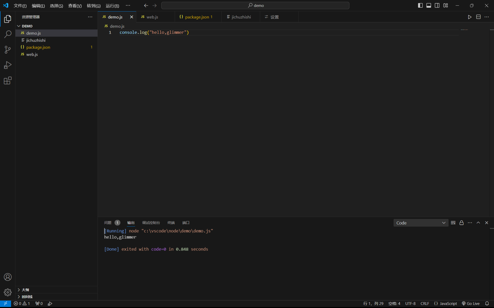
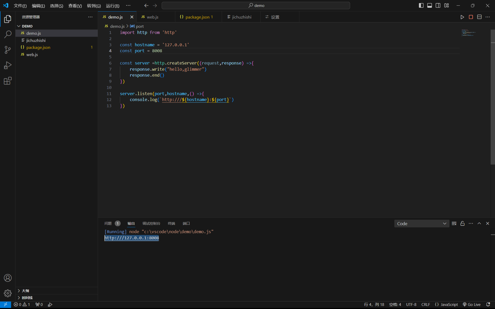
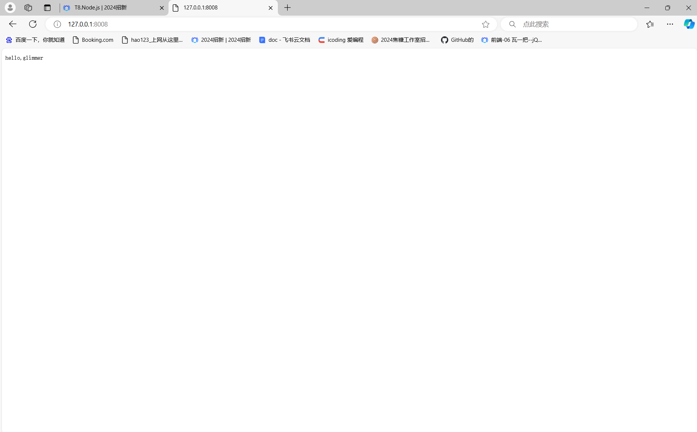
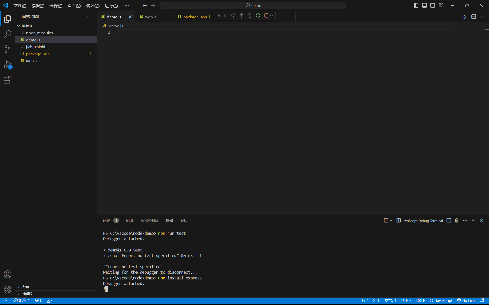
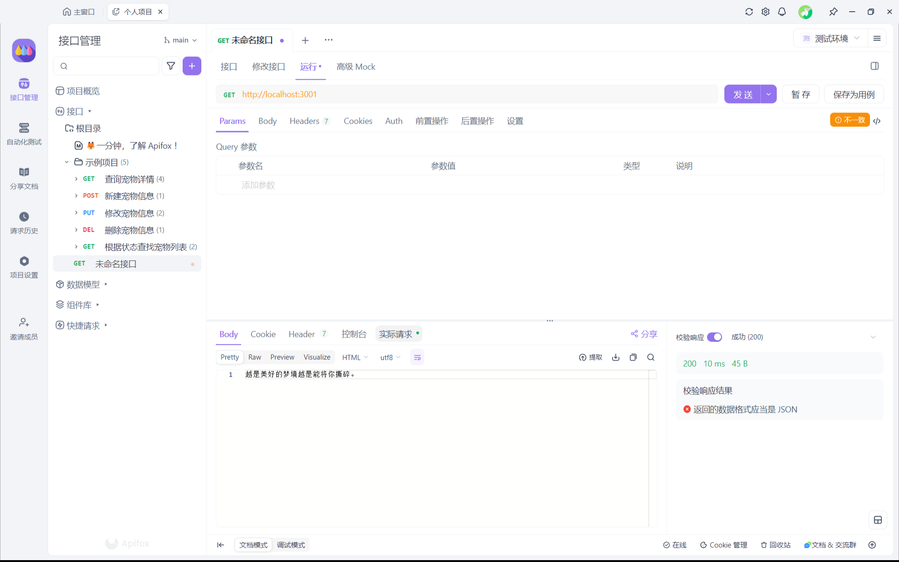

stap1:

步骤说明:在浏览器下载node.js并配置,创建文件并进行初始化，输入打印代码点击右上角三角形运行（这里使用了code runner插件，不使用插件的话在终端处输入 node 文件名 再回车）.在浏览器内显示:使用http模块创建并启用服务器,然后在浏览器中搜索地址。

stap2:

说明：初始化之后在终端处输入  npm install  express 回车等待下载完成
stap3:
测试结果如下

代码如下:
const express = require('express')
const app = express()
const port = 3001
const sentences =["苦到头未必是甜的，而甜到头一定是苦的 。","你要明白，你爱的不是那段时光，不是那个念念不忘的人，不是那段经历，你爱的只是当年那个羽翼未丰但依然执迷不悔的自己。","少年终将为王。","不是所有的鱼都会生活在同一片海里","当一个人公平公正地去对待每个人的时候， 那便等同于他已经无法爱上任何人。","越是美好的梦境越是能将你撕碎。","1/7的概率你刷到了我这个句子,嘿嘿"]
app.get('/', (req, res)=>{
    const randomi= Math.floor(Math.random() *sentences.length);
    const randoms= sentences[randomi];
    res.send(randoms)
})

app.listen(port,()=>{
    console.log(`http://localhost:${port}`)
})
